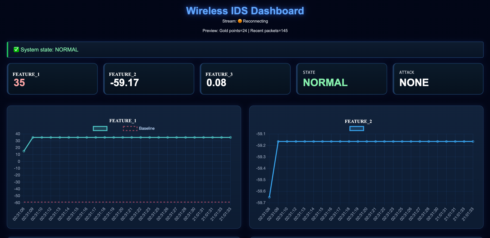
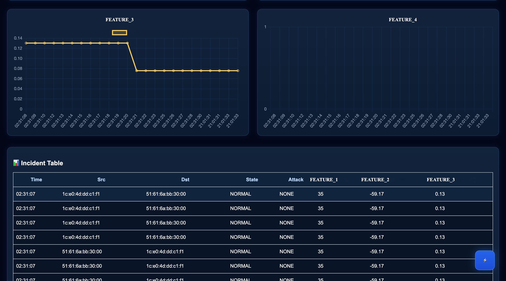
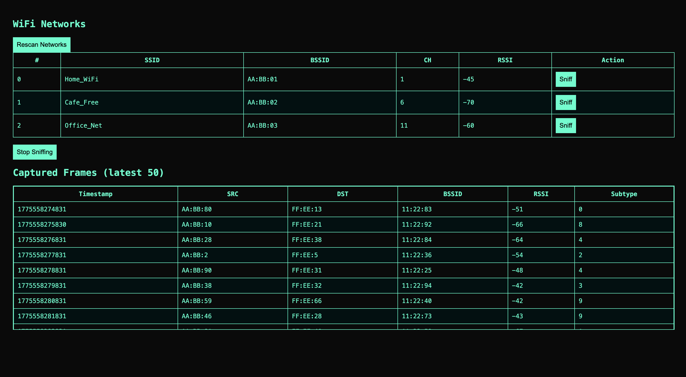
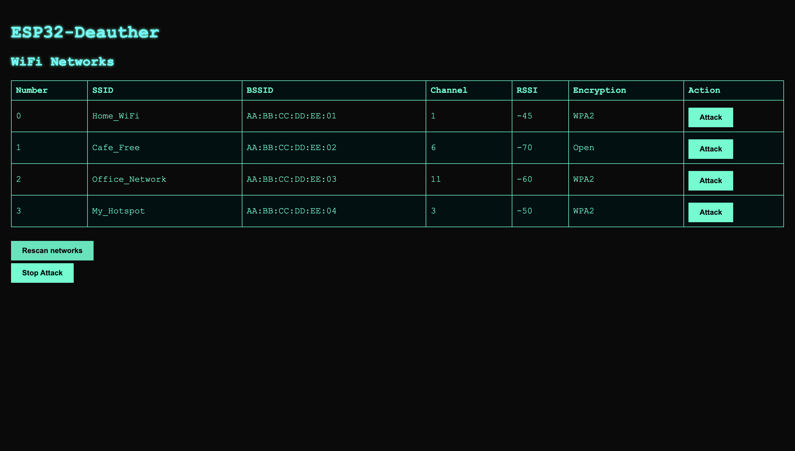

# Wireless IDS System

A comprehensive wireless intrusion detection system with real-time monitoring, ML-based detection, and multi-layer data processing.

## Project Overview

This repository contains the complete implementation of a wireless network security monitoring system with components for:
- **ESP32 Sniffer**: Packet capture and WiFi monitoring
- **ESP32 Deauther**: Network testing capabilities
- **Dashboard**: Real-time visualization and analytics
- **Backend**: Multi-layer data pipeline with ML inference
- **ML Service**: Anomaly detection classifier

## Gallery

### Dashboard Visualizations

### System Components

## License

This project is source-available under a custom license.

- Non-commercial use only
- Commercial use requires explicit permission

See LICENSE file for details.